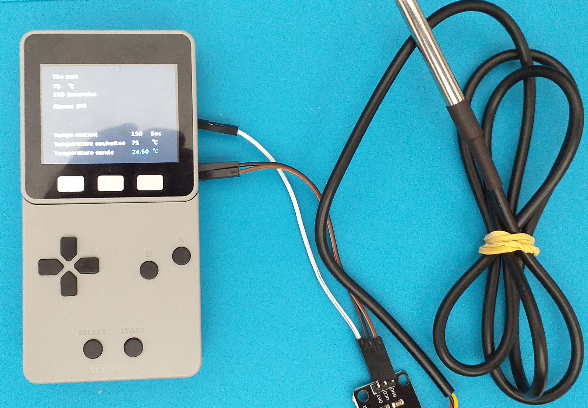

# m5_sonde_liquide
utilisation du M5Stack gray avec gameboy face

Une sonde de température avec des données prédéfinies (thé, café, etc...) et une durée d'infusion quand nécessaire.

La température est modifiable.

Matériel : une sonde thermique étanche ds18b20, un M5stack et la gameboy FACE.

Créé avec l'uiflow de M5stack https://flow.m5stack.com/

nécessite la bibliothèqe https://github.com/stonatm/UiFlow-custom-blocks/tree/master/ds18b20

Voir cette adresse pour l'utilisation mais il faut d'abord ouvrir le fichier ds18b20.m5b avec l'uiflow puis le fichier m5f sinon il y a une erreur.

Utilisation:

la broche DAT de la sonde est branché sur l'entrée 26 du M5stack (pin DAT on pin 26)

selection des températures et durée prédéfinies avec UP et Down.

Changement de la température manuellement avec "LEFT" et "Right"

L'alarme sonne quand la température souhaitée est atteinte ou dépassée.

L'alarme peut être mise en route ou stopée avec "START".

Le minuteur est enclenché avec la touche "A", arrêté avec la touche "B" et fait un bip quand atteint zéro.

Reste à faire : 

une traduction en anglais.

peut être rajouter des dessins pour rendre plus attractif.

améliorer la précision de la minuterie.

Possibilités d'évoution :

rajouter un relais pour arrêter éventuellement l'appareil

un servo moteur pour descendre et relever l'infusion
